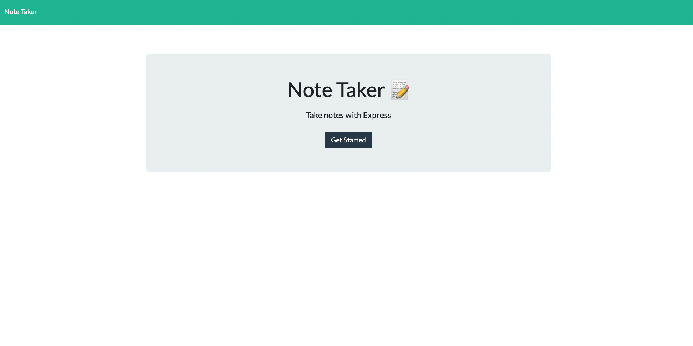

# Digital Notebook
## Table of Contents
- [Installation](#installation)
- [Usage](#usage)
- [Credits](#credits)
- [License](#license)
- [Contact](#contact)
## Description
The Digital Notebook provides the user with an app to keep all notes as they move through the day. It supports the user with remaining organized with different projects, meetings, and daily to do's.
## Installation
The project is a web-based app accessible via heroku. It can be located through the url:https://pure-basin-17915.herokuapp.com/ . To use and access the app as a developer, the app is housed on github via the url:https://github.com/bk7711/digital-notebook . The project uses the express.js, fs, and path packages, within node.js.
## Usage
Digital Notebook provides the user with an organization tool and can be a great starter app for a larger calendar, organization, or business management idea.

## Credits 
The starter code including the front end development code was provided by Rutgers University via the miniture-eureka app housed on github via the url:https://github.com/coding-boot-camp/miniature-eureka .
## License
none
## How to Contribute
Feel free to use or refractor this code for further development and to make it scaleable.

# Contact
- Github: bk7711
- LinkedIn: www.linkedin.com/in/carolyn-blackwell
- E-mail: bmathematics@gmail.com